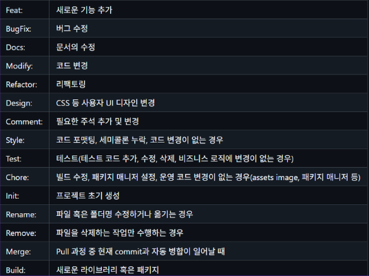
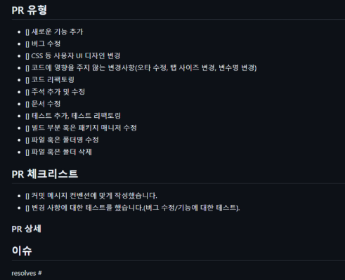
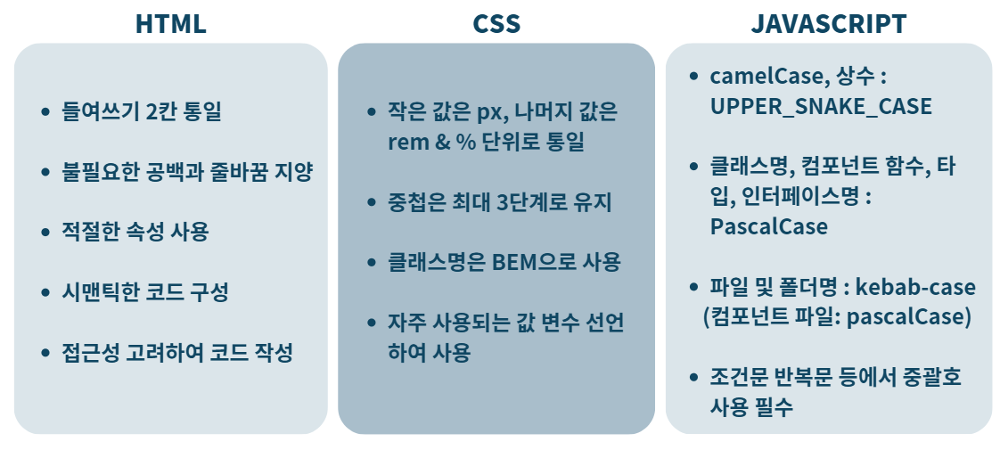
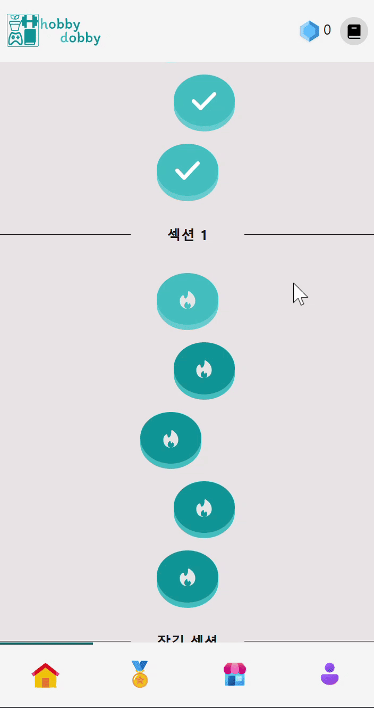
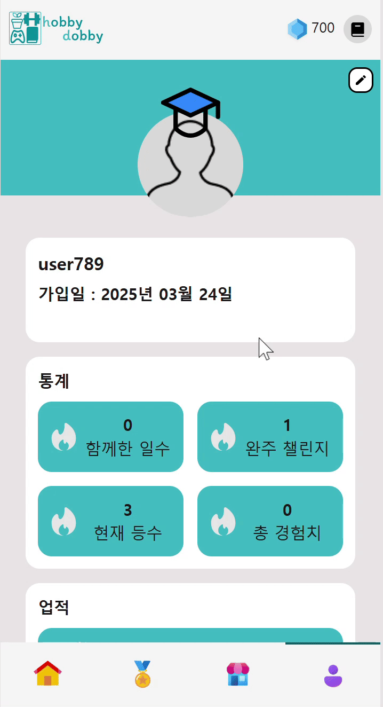
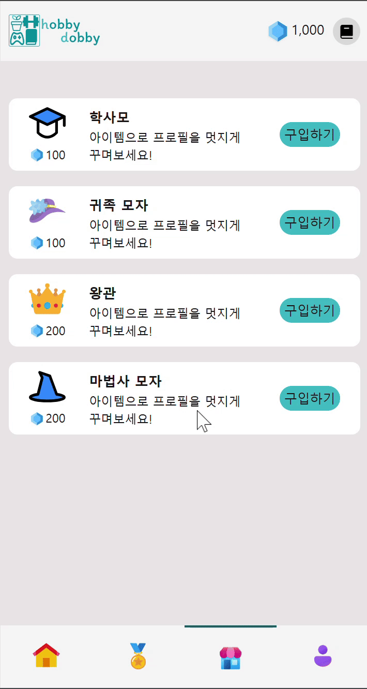
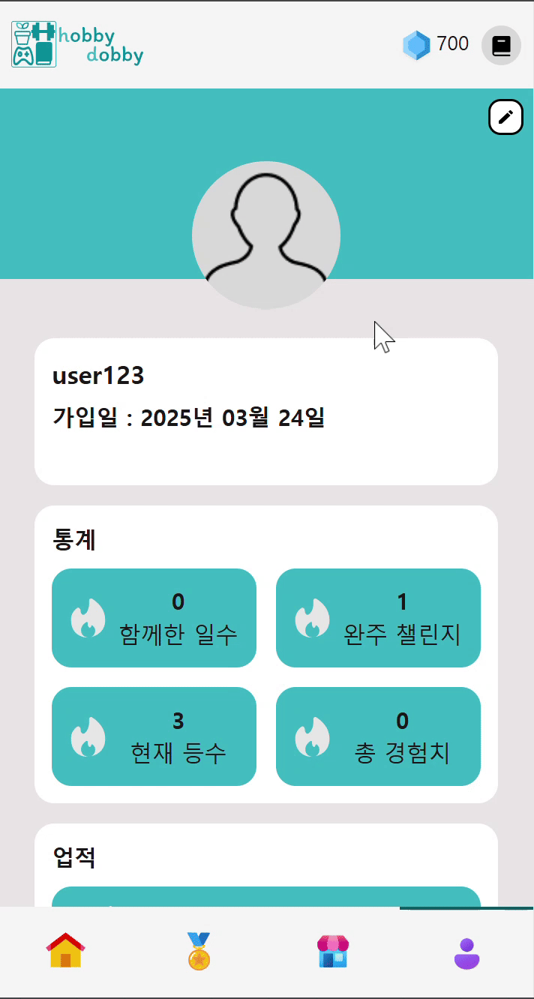

# 멋쟁이 사자처럼 FrontEnd Final Project 3조  Recherin_ThreeStar의 HobbyDobby입니다! 🧙‍♂️

<!--  -->

**Github URL : [바로가기](https://github.com/FRONTENDBOOTCAMP-12th/HobbyDobby-3rd)**

**Wiki URL : [바로가기](https://github.com/FRONTENDBOOTCAMP-12th/HobbyDobby-3rd/wiki)**

**Figma URL : [바로가기](https://www.figma.com/design/rd4mKDnBo0GhmnCxmpdeGo/%EB%A9%8B%EC%82%AC_%ED%8C%8C%EC%9D%B4%EB%84%90%ED%94%84%EB%A1%9C%EC%A0%9D%ED%8A%B8_3%EC%A1%B0?node-id=0-1&p=f)**

**배포 URL : [바로가기](https://monumental-lokum-fd083d.netlify.app/)**

**테스트 계정 : testbot12 / 123456q!**

## 📖 목차

1. 조원
2. 프로젝트 소개
3. 프로젝트 안내
4. 페이지별 설명

## 🏙️ 조원

### 조원 소개

|  이름  |               공세현                |                 이소민                 |                이영범                |                전혜림                 |
| :----: | :---------------------------------: | :------------------------------------: | :----------------------------------: | :-----------------------------------: |
|  역할  |                조장                 |                  조원                  |                 조원                 |                 조원                  |
| Github | [공세현](https://github.com/kongsh) | [이소민](https://github.com/somin2352) | [이영범](https://github.com/lyb9030) | [전혜림](https://github.com/mintnaka) |

### 프로젝트 내 목표

- 어려운 일이 되겠지만, 과정을 즐기면서 하자.

## 🖥️ 프로젝트 소개

### 기간

2025.02.24 (Mon) ~ 2025.03.25 (Tue)

- 2025.02.24 ~ 02.27 : 초기 기획 및 디자인
- 2025.02.28 ~ 03.01 : DB 설계 및 백로그 작성
- 2025.03.02 ~ 03.06 : 공용 컴포넌트 작업 및 로그인 / 회원가입 구현 작업
- **2025.03.04 : 프로젝트 초기 기획 발표**
- 2025.03.07 ~ 03.12 : 마이 페이지 / 리더보드 페이지 작업
- **2025.03.13 : 프로젝트 중간 점검**
- 2025.03.14 ~ 03.20 : 스토어 페이지 / 리더보드 페이지 작업
- 2025.03.21 ~ 03.24 : 배포 및 발표 준비
- **2025.03.25 : 프로젝트 최종 발표**

### 사용된 기술

- Frontend : 
  
- Backend & Deploy : 
  

- Cooperation : 
  

## 🗂️ 프로젝트 상세 설명

### 폴더 구조

📁 HOBBYDOBBY-3RD

    📦src
     ┣ 📂components
     ┃ ┣ 📂ArrowButtons
     ┃ ┣ 📂BottomNavbar
     ┃ ┣ 📂CloseButton
     ┃ ┣ 📂CustomButton
     ┃ ┣ 📂ErrorBoundary
     ┃ ┣ 📂Form
     ┃ ┣ 📂HeadingLogo
     ┃ ┣ 📂HobbySelect
     ┃ ┣ 📂LeaderBoard
     ┃ ┣ 📂MainComponents
     ┃ ┣ 📂MainpageEnd
     ┃ ┣ 📂MyPage
     ┃ ┣ 📂MyPageEditProfile
     ┃ ┣ 📂ProgressBar
     ┃ ┣ 📂Spinner
     ┃ ┣ 📂StoreItem
     ┃ ┣ 📂SubHobbySelect
     ┃ ┣ 📂TopNavbar
     ┃ ┗ 📂UnitPage
     ┣ 📂hooks
     ┣ 📂layouts
     ┃ ┣ 📂main-layout
     ┃ ┣ 📂scroll-to-top
     ┃ ┗ 📂title
     ┣ 📂lib
     ┣ 📂pages
     ┃ ┣ 📂hobby-select
     ┃ ┣ 📂landing-page
     ┃ ┣ 📂leader-board-completed
     ┃ ┣ 📂leader-board-detail
     ┃ ┣ 📂leader-board-ranking
     ┃ ┣ 📂login
     ┃ ┣ 📂main-page
     ┃ ┣ 📂main-page-end
     ┃ ┣ 📂main-page-start
     ┃ ┣ 📂my-page
     ┃ ┣ 📂my-page-edit-profile
     ┃ ┣ 📂register
     ┃ ┣ 📂store-page
     ┃ ┣ 📂subhobby-select
     ┃ ┣ 📂unit-page
     ┃ ┗ 📂withdraw
     ┣ 📂stores
     ┣ 📂styles
     ┃ ┗ 📂common
     ┣ 📂types
     ┃ ┣ 📂my-page
     ┃ ┗ 📂my-page-edit-profile
     ┗ 📂utils

## 

### 유저 플로우 차트

test

### 팀 컨벤션

**커밋 컨벤션** 

**PR 템플릿**  

**코딩 컨벤션**  

### 기능 소개

|     제목     | 상세설명                                                                                                                                                     |
| :----------: | :----------------------------------------------------------------------------------------------------------------------------------------------------------- |
|     주제     | [메인페이지-챌린지 시작하기]()                                                                                                                               |
|  동작 화면   |                                                                                                  |
| 기능 및 구현 | - 시작 버튼을 누르면 챌린지에 대한 요청사항이 발생   - 설문 진행에 따른 상단의 프로그래스바가 변경   - 답변에 따른 button 선택 및 타이핑으롤 설문 진행 |

 

|     제목     | 상세설명                                                                                                  |
| :----------: | :-------------------------------------------------------------------------------------------------------- |
|     주제     | [마이페이지-로그아웃]()                                                                                   |
|  동작 화면   |                                                 |
| 기능 및 구현 | - 로그아웃 버튼을 작동하면 로그아웃 하겠냐는 안내창 발생  - 로그아웃이 완료되면 랜딩페이지로 자동 이동 |

 

|     제목     | 상세설명                                                                      |
| :----------: | :---------------------------------------------------------------------------- |
|     주제     | [스토어페이지-구매하기]()                                                     |
|  동작 화면   |                         |
| 기능 및 구현 | - 스토어 상품을 구매하기 진행   - 구매 진행시 보석이 구매 금액에 맞게 차감 |

 

|     제목     | 상세설명                                                                      |
| :----------: | :---------------------------------------------------------------------------- |
|     주제     | [마이페이지-아이템 사용하기]()                                                |
|  동작 화면   |                    |
| 기능 및 구현 | - 프포필 설정 창으로 이동   - 보유중인 아이템을 클릭 시 프로필 사진에 적용 |

 
